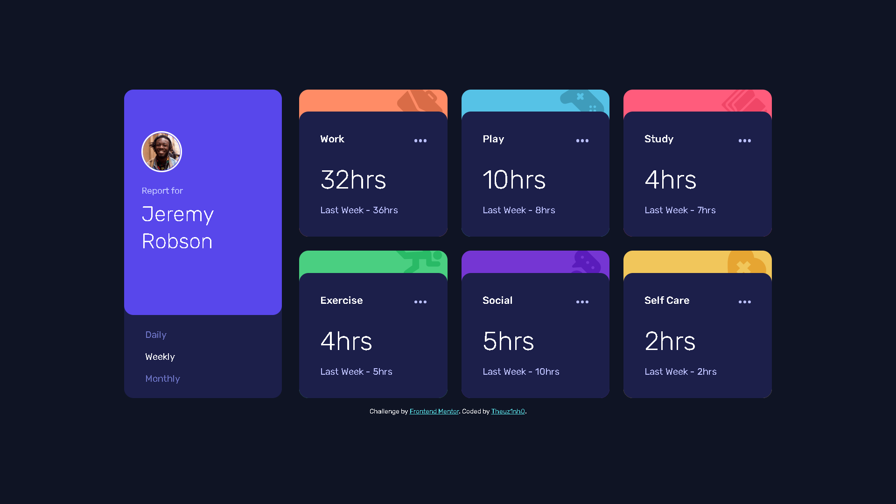

# Frontend Mentor - Time tracking dashboard solution

## Table of contents

- [Overview](#overview)
  - [The challenge](#the-challenge)
  - [Screenshot](#screenshot)
  - [Links](#links)
- [My process](#my-process)
  - [Built with](#built-with)
  - [What I learned](#what-i-learned)
  - [Continued development](#continued-development)
- [Author](#author)

## Overview

### The challenge

Users should be able to:

- View the optimal layout for the site depending on their device's screen size
- See hover states for all interactive elements on the page
- Switch between viewing Daily, Weekly, and Monthly stats

### Screenshot



### Links

- Solution URL: [URL](https://github.com/Theuz1nh0/time-tracking-dashboard)
- Live Site URL: [URL](https://theuz1nh0.github.io/time-tracking-dashboard/)

## My process

### Built with

- Semantic HTML5 markup
- Flexbox
- CSS Grid
- Mobile-first workflow

### What I learned

```js
const request = new XMLHttpRequest();
request.open('GET', jsonLink);
request.responseType = 'json';
request.send();
request.onload = () => {
    const data = request.response;
    contentsOfContainers(data)
}
```

### Continued development

Pretendo continuar focando em JS, apromorando esse site e reescrevendo ele futuramente em React, pretendo também reescrever o CSS com um framework(SASS)

## Author

- Frontend Mentor - [@Theuz1nh0](https://www.frontendmentor.io/profile/Theuz1nh0)
- Linkedin - [Mateus Moura Domingos](https://www.linkedin.com/in/theuz1nh0/)
